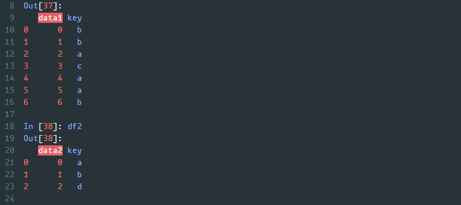

## 解决问题：

原版中如果python代码块中有jupyter notebook的输出，某些单词会被认为是语法错误而标记红色，如下图



两种解决办法：

 	1. 将catfish.css文件中的包含error的块注释掉。本版本的css已修改
 	2. 利用脚本将md文件中的输出 `Out[] :`等块单独隔离出来，使用java标记的代码块

# 原 Readme

> Designed and tested on Windows 10, version 1703. Not fully tested, but should work for macOS/Linux. 

# Catfish

This theme provides a comfortable display of CJK characters by using [source-han-sans](https://github.com/adobe-fonts/source-han-sans) and [source-han-serif](https://github.com/adobe-fonts/source-han-serif).

Code Fence uses theme ported from [material.css](https://codemirror.net/theme/material.css).

无衬线字体，衬线字体和等宽字体分别采用思源黑体，思源宋体， mononoki ，在 Windows 下有良好的中文呈现效果。

代码高亮使用 Material 配色。

_screenshots:_


------

**Update** 2017.08.18

I selected Simplified Chinese glyphs as default, and used Language-specific OTFs. It can be used directly by Simplified Chinese users.

If you want use Traditional Chinese, Japanese or Korean. There are two way to change to another language.

1. Downloading latest release from [Source Han Sans](https://github.com/adobe-fonts/source-han-sans/tree/release) and [Source Han Serif](https://github.com/adobe-fonts/source-han-serif/tree/release) . And then change `font-face`and`font-family`according to the fonts you downloading.

   e.g

   ```css
   @font-face
       font-family Source Han Sans SC
       font-weight normal
       src local('Source Han Sans SC Regular'),url(catfish/SourceHanSansSC-Regular.otf)

   font-sans = Source Han Sans SC, sans-serif
   ```

   ​

2. Installing Super OTC. (It is included in catfish folder or you can also choose to download from official website.)

   > This deployment format requires macOS (OS X) Version 10.8 (aka *Mountain Lion*) or later, iOS 7 or later, Windows 10 Version 1703 (aka *Creators Update*) or later, a flavor of Linux that uses *fontconfig* and FreeType Version 2.5.0.1 or greater, or Adobe CS6 apps or later.

   There are other deployments available in Github.

   You can remove`font-face` of Source Han Sans and Source Han Serif and just modify font-family accordingly.


Sorry for the inconvenience. 

